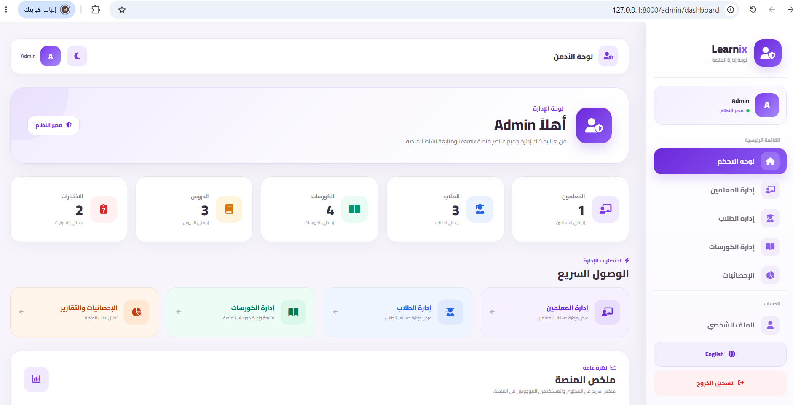
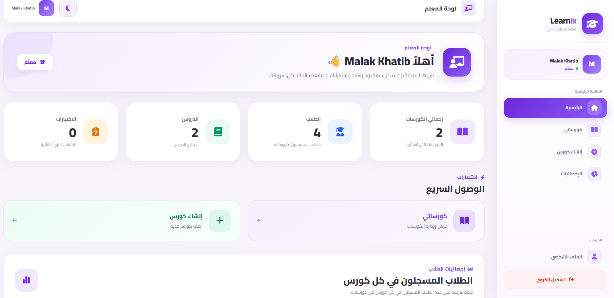
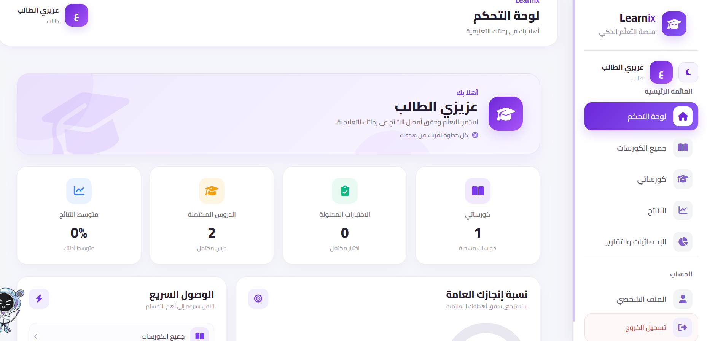
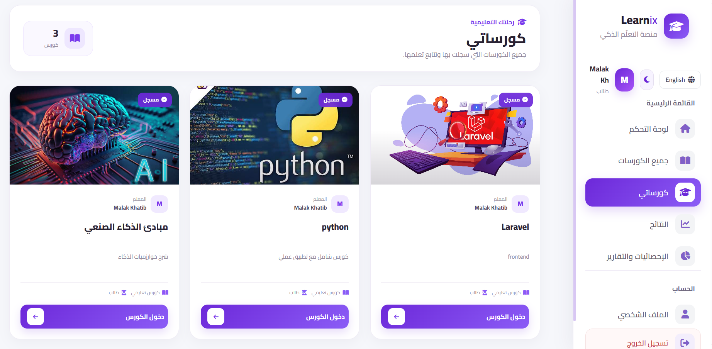
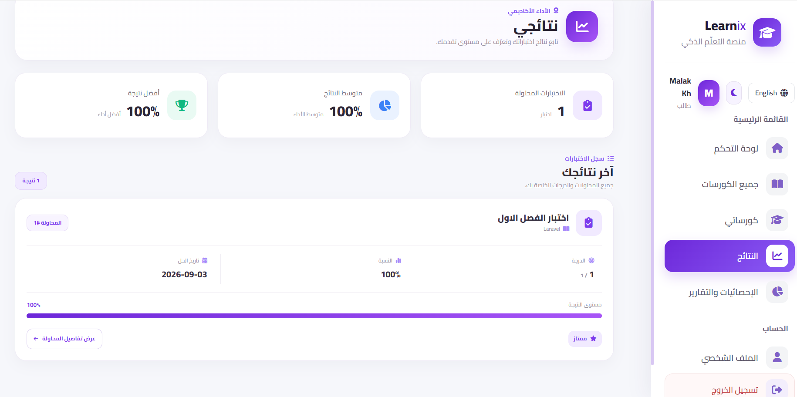
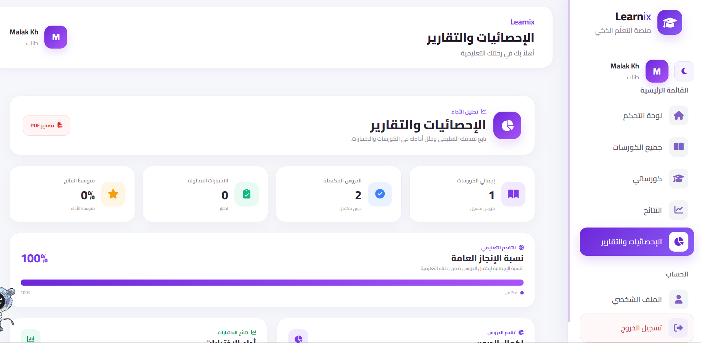

# 🎓 Learnix – Educational Platform

**Learnix** is a web-based Learning Management System (LMS) designed to provide an organized and interactive educational environment for **administrators, teachers, and students**.

The platform was developed as a university semester project using **Laravel** and follows the **MVC (Model–View–Controller)** architecture.

---

## 📌 About the Project

Learnix aims to simplify the management of online educational content by providing separate functionalities for administrators, teachers, and students.

The system allows:

* Administrators to manage users, teachers, students, and courses.
* Teachers to create and manage courses, lessons, quizzes, questions, and answers.
* Students to browse courses, enroll in courses, study lessons, take quizzes, and view their results.

---

## 👥 User Roles

### 👨‍💼 Administrator

* Manage teachers
* Manage students
* Manage courses
* Manage the educational platform

### 👨‍🏫 Teacher

* Create and manage courses
* Add lessons
* Create quizzes
* Add questions and answers
* Specify correct answers
* Manage educational content

### 👨‍🎓 Student

* Browse available courses
* View course details
* Enroll in courses
* Study lessons
* Take quizzes
* View quiz results

---

## ✨ Main Features

* 🔐 Authentication and access control
* 👥 Role-based permissions
* 📚 Course management
* 📖 Lesson management
* 📝 Quiz management
* ❓ Questions and answers
* ✅ Correct-answer management
* 📊 Student results
* 🗄️ Relational database structure
* 📱 Responsive user interface
* 🧩 Organized MVC architecture

---

## 🛠️ Technologies Used

| Technology     | Purpose                    |
| -------------- | -------------------------- |
| PHP            | Backend programming        |
| Laravel        | Web application framework  |
| MySQL          | Relational database        |
| Blade          | Frontend templating        |
| Bootstrap 5    | Responsive UI              |
| CSS            | Styling                    |
| JavaScript     | Interactive functionality  |
| Laravel Breeze | Authentication             |
| Vite           | Frontend asset development |

---

## 🏗️ System Architecture

Learnix follows the **MVC (Model–View–Controller)** architectural pattern provided by Laravel.

```text
User
  │
  ▼
Routes
  │
  ▼
Controllers
  │
  ├── Models ───► MySQL Database
  │
  ▼
Blade Views
  │
  ▼
User Interface
```

This structure helps separate application logic, data management, and presentation.

---

## 🗄️ Database

The platform uses **MySQL** as its relational database.

The database includes entities related to:

* Users
* Courses
* Lessons
* Quizzes
* Questions
* Answers
* Enrollments
* Results

The database relationships are designed to maintain data consistency and support the different roles and functionalities of the platform.

---

## ⚙️ Installation & Setup

### 1. Clone the Repository

```bash
git clone https://github.com/MalakKhatib/Learnix-Educational-Platform.git
```

### 2. Navigate to the Project

```bash
cd Learnix-Educational-Platform
```

### 3. Install PHP Dependencies

```bash
composer install
```

### 4. Install Frontend Dependencies

```bash
npm install
```

### 5. Create the Environment File

Copy `.env.example` to `.env`:

```bash
cp .env.example .env
```

On Windows CMD, you can use:

```bash
copy .env.example .env
```

### 6. Generate the Application Key

```bash
php artisan key:generate
```

### 7. Configure the Database

Open the `.env` file and configure your MySQL database:

```env
DB_DATABASE=learnix
DB_USERNAME=root
DB_PASSWORD=
```

### 8. Run Database Migrations

```bash
php artisan migrate
```

### 9. Start the Development Server

```bash
php artisan serve
```

The application will be available at:

```text
http://127.0.0.1:8000
```

---

## 🚀 Running the Frontend

For frontend asset development, run:

```bash
npm run dev
```

---

## 📚 Project Objectives

The main objectives of Learnix are to:

* Provide an organized digital learning environment.
* Simplify educational content management.
* Separate system responsibilities according to user roles.
* Improve the learning experience for students.
* Provide teachers with tools to manage educational content.
* Apply practical software engineering concepts in a real-world project.

---

## 🔒 Security

The project uses Laravel's authentication and authorization mechanisms to control access to different parts of the platform.

Sensitive configuration files such as `.env` are excluded from the repository using `.gitignore`.

---

## 🎓 University Project

This project was developed as a **university semester project** at:

**University of Idlib**
**Faculty of Informatics Engineering**

### Project Title

**Development of Learnix Educational Platform**

### Supervisor

**Eng. Ahmed Zoua**

### Team

* **Somaya Al-Khalaf**
* **Malak Khatib**
* **Zahraa Al-Taha**
* **Mawiya Zouaa**

### Academic Year

**2025 – 2026**

---

## 🔮 Future Development

Possible future improvements include:

* Online video lessons
* Advanced student progress tracking
* More detailed analytics and reports
* Notifications system
* Online assignments
* Enhanced quiz functionality
* Improved teacher and student dashboards
* Additional learning resources

---

## 👩‍💻 Developer

**Malak Khatib**

GitHub: [MalakKhatib](https://github.com/MalakKhatib)

LinkedIn: [Malak Khatib](https://www.linkedin.com/in/malak-kh-2a92b6359)

---

## 📄 License

This project was developed for educational purposes as a university project.

## 📸 Project Screenshots

### 🛠️ Admin Dashboard



### 👨‍🏫 Teacher Dashboard



### 👨‍🎓 Student Dashboard



### 📚 My Course



### 📝 Quiz Results



### 📊 Student Report



